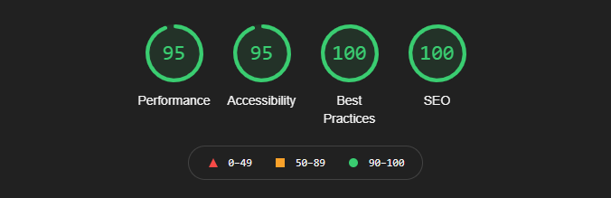
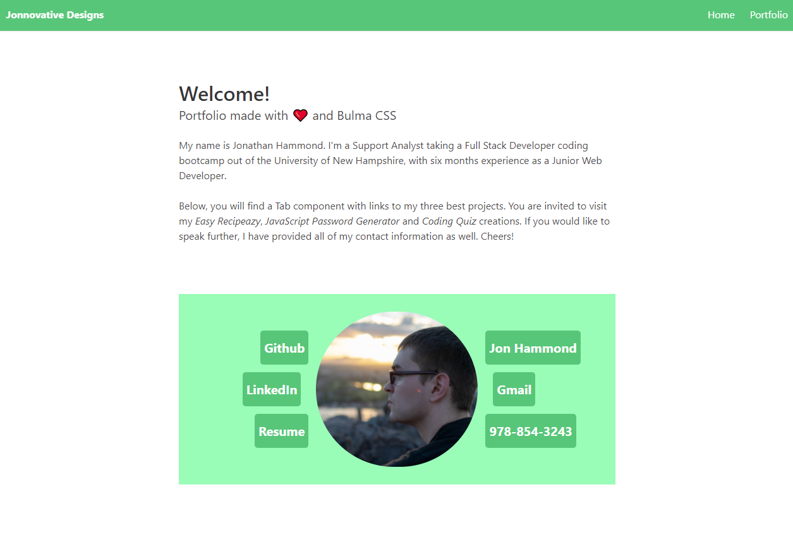
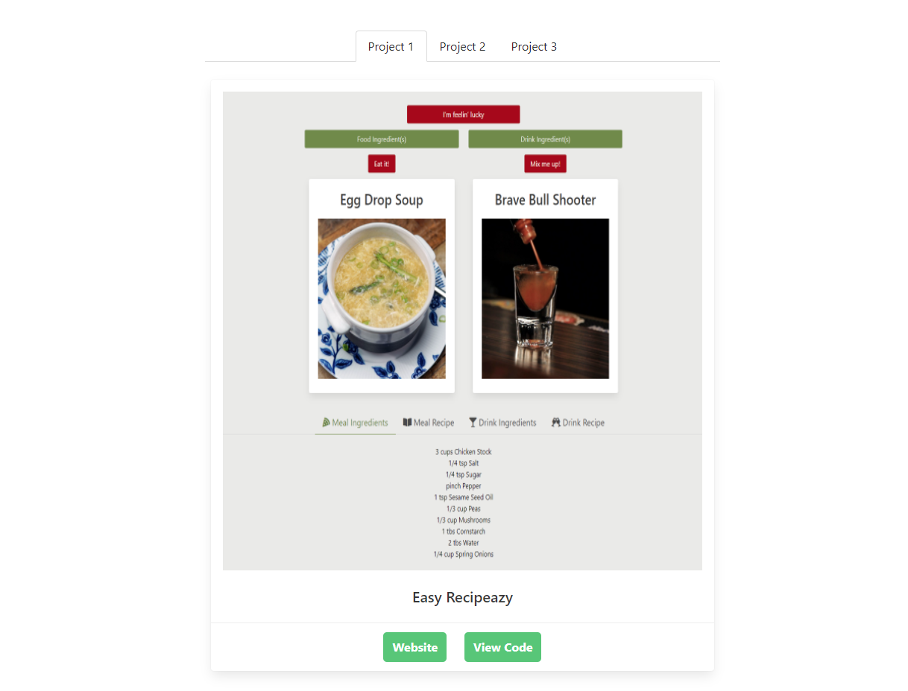

# jonnovative-portfolio

*My updated Responsive Portfolio website made with Bulma*

[View Deployed Application Here.](https://pythonidaer.github.io/jonnovative-portfolio/)

## Installation
1. Clone repository to your local device
2. Folders are structured already, so test by opening the index.html file in your browser. If it looks good, it's working right.
3. If it does not work, right-click Inspect console to determine if there is an issue with the directories.

## Usage
This repo is simply a homework assignment. Feel free to inspect the code and notice how I made a single page responsive website using Bulma components:
- Navigation
- Scroll-click
- Tabs
- Cards
- Inspection Observer
  
## Credits
[Bulma CSS Tutorial, Net Ninja, YouTube](https://www.youtube.com/watch?v=SCSAExGFK1E&list=PL4cUxeGkcC9iXItWKbaQxcyDT1u6E7a8a)

[Bulma Documentation](https://bulma.io/documentation/overview/start/)

[iamshaunjp GitHub Branches of Bulma Course](https://github.com/iamshaunjp/bulma-ui-build/branches/stale)

[Bulma Fixed Navbar](https://bulma.io/documentation/components/navbar/#fixed-navbar)

[Bulma Flexbox Helpers](https://bulma.io/documentation/helpers/flexbox-helpers/)

[Codepen Flexbox Playground](https://codepen.io/enxaneta/full/adLPwv)

[JavaScript select nested class element, Stack Overflow](https://stackoverflow.com/questions/25487402/javascript-select-nested-class-element)

[jQuery UI toggleClass()](https://jqueryui.com/toggleClass/)

[Placeholder images](https://placeholder.com/)

[How to center a section with bulma, Stack Overflow](https://stackoverflow.com/questions/53244082/how-to-center-a-section-with-bulma)

[Make Gmail your default email program](https://support.google.com/a/users/answer/9308783?hl=en)

[Adding an HTML Phone Number](https://www.elegantthemes.com/blog/wordpress/call-link-html-phone-number)

[Heart Emoji](https://emojipedia.org/red-heart/)

[Adding mouseover text with the HTML title attribute](http://sites.cognitivescience.co/knowledgebase/resources/using-google-sites/creating-mouseover-text-with-html)

[Scroll-Behind Blurred Site Navigation Bar](http://thenewcode.com/990/Scroll-Behind-Blurred-Site-Navigation-Bar)

[Easy Scroll-Behind Blurred Navigation Bar](https://codepen.io/dudleystorey/pen/RNMbGG)

[Smooth Scrolling with jQuery Codepen](https://codepen.io/kevinpowell/pen/dWzGox)

[Kevin Powell - How to add Smoth Scrolling to your one page website with jQuery](https://www.youtube.com/watch?v=x0YnVwAuNQI)

[JavaScript areaObject hash property](https://www.w3schools.com/jsref/prop_area_hash.asp)

[jQuery offset()](https://www.w3schools.com/jquery/css_offset.asp)

[jQuery scrollTop()](https://api.jquery.com/scrolltop/)

[JavaScript animate()](https://developer.mozilla.org/en-US/docs/Web/API/Element/animate)

[Stack Overflow and flexbox](https://stackoverflow.com/questions/28519208/flexbox-how-to-do-space-around-in-vertical)

[Fade and scroll items into view while scrolling](https://www.youtube.com/watch?v=huVJW23JHKQ)

[Intersection Observer Repo](https://github.com/kevin-powell/slide-in-with-intersection-observer/tree/master/finished/css)

[Web AIM Contrast Checker](https://webaim.org/resources/contrastchecker/)

[Adding a license to a repository](https://docs.github.com/en/github/building-a-strong-community/adding-a-license-to-a-repository)

## License
I've chosen an MIT License. Do what you'd like with this material.

#### The Proof

#### The Website

